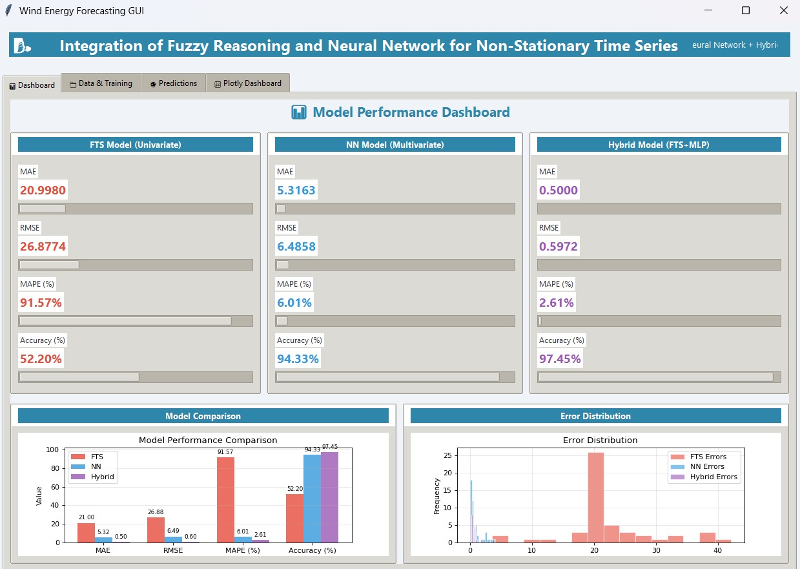
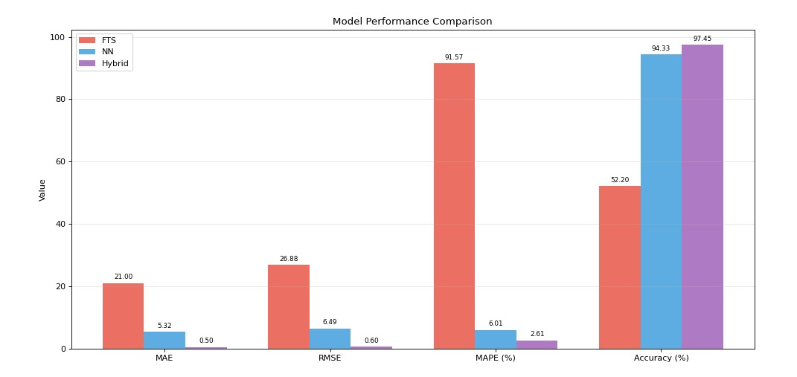
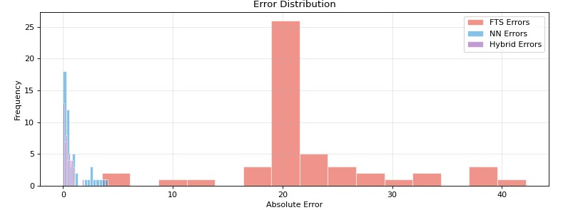
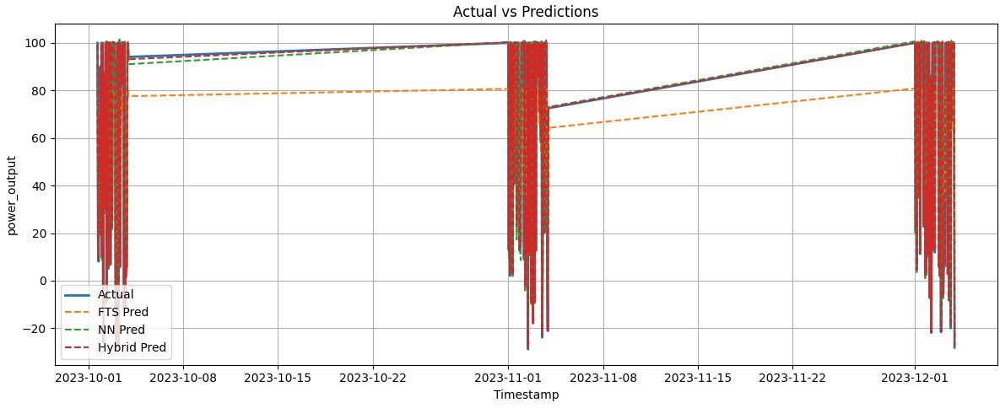
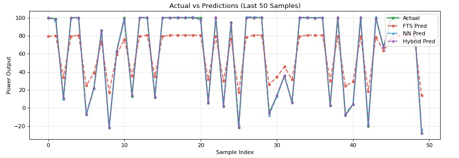

# 🚀  Hybrid Fuzzy-Neural Network for Wind Power Forecasting

---

## Abstract

Accurate wind power forecasting is essential for efficient energy management and grid stability. However, wind data is inherently non-linear, uncertain, and time-dependent. This project proposes a hybrid forecasting framework that integrates Fuzzy Time Series (FTS) and Neural Networks to improve prediction accuracy. By combining rule-based reasoning with data-driven learning, the system captures both uncertainty and complex temporal patterns effectively.

---

## Problem Statement

Wind power generation is highly volatile due to environmental fluctuations such as wind speed variations and atmospheric conditions. Traditional models struggle to handle:

* Non-linear relationships
* Temporal dependencies
* Data uncertainty

This project aims to develop a hybrid model that improves forecasting performance by combining fuzzy logic with neural networks.

---

## Methodology

The system integrates three approaches:

### 1. Fuzzy Time Series (FTS)

* Converts numerical data into fuzzy intervals
* Handles uncertainty using linguistic rules
* Captures approximate trends

### 2. Neural Network

* Learns complex non-linear relationships
* Models temporal dependencies in time-series data
* Improves predictive accuracy

### 3. Hybrid Model (FTS + Neural Network)

* Combines fuzzy reasoning with neural learning
* Enhances generalization capability
* Reduces forecasting error

---

## System Workflow

1. Data loading
2. Data preprocessing and normalization
3. Model training (FTS, Neural Network, Hybrid)
4. Prediction generation
5. Performance evaluation
6. Visualization of results

---

## Dataset

The dataset used in this project consists of wind energy observations designed to simulate real-world forecasting scenarios.

* **Dataset Size:** Approximately 200–500 samples
* **Features:** Wind speed, power output, and time-based attributes
* **Type:** Structured time-series data

The dataset is used consistently across all models for training and evaluation.

---

## Evaluation Metrics

Model performance is evaluated using:

* **MAE (Mean Absolute Error)**
* **RMSE (Root Mean Squared Error)**
* **MAPE (Mean Absolute Percentage Error)**

Lower values indicate better forecasting accuracy.

---

## Results and Analysis

The experimental results highlight clear differences between the models:

* The **Fuzzy Time Series (FTS)** model shows higher error due to its limited ability to capture complex non-linear patterns
* The **Neural Network** performs better by learning hidden relationships in time-series data
* The **Hybrid model** achieves the best performance by combining fuzzy reasoning with neural learning

The hybrid approach improves stability and reduces prediction error, making it more effective for handling uncertainty in wind forecasting.

**Best Model Performance (Hybrid Model):**

* MAE: 0.5000
* RMSE: 0.5972
* MAPE: 2.61%
* Accuracy: 97.45%

---

## Visual Results

### Model Performance Dashboard

### Model Comparison

### Error Distribution

### Forecast Results

### Detailed Forecast (Last 50 Samples)

---

## Key Contributions

* Development of a hybrid fuzzy-neural forecasting model
* Integration of rule-based and machine learning approaches
* Comparative evaluation of multiple models
* Visualization-driven analysis of forecasting performance
* Implementation of an interactive GUI-based system

---

## Limitations

* The dataset is moderate in size and may not fully represent large-scale real-world scenarios
* The neural network architecture is relatively simple
* External environmental factors are not extensively incorporated

---

## Future Work

* Apply deep learning models such as LSTM for improved time-series forecasting
* Validate the model on large-scale real-world datasets
* Incorporate additional environmental variables for enhanced accuracy
* Extend the system to real-time forecasting applications

---

## Demo Video

[Watch Demo Video](https://drive.google.com/file/d/1ak_rm5ln8C0gzAR57zSfQ-ilGSsfhFF1/view?usp=sharing)

---

## Conclusion

This project demonstrates that combining fuzzy logic with neural networks significantly improves wind power forecasting accuracy. The hybrid model effectively captures both uncertainty and complex temporal dependencies, providing a reliable solution for time-series prediction tasks.

---

## Author

Digumurthy Sruthi Sarika
