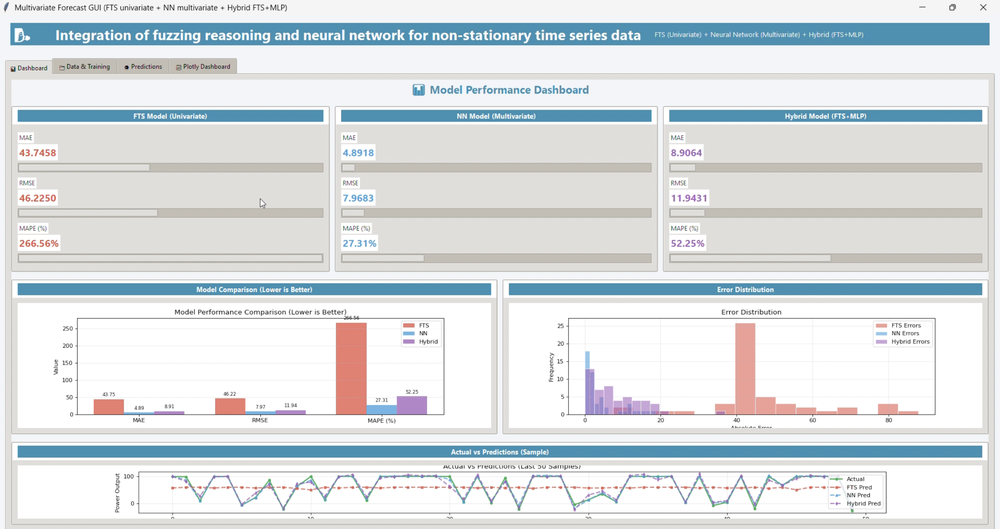
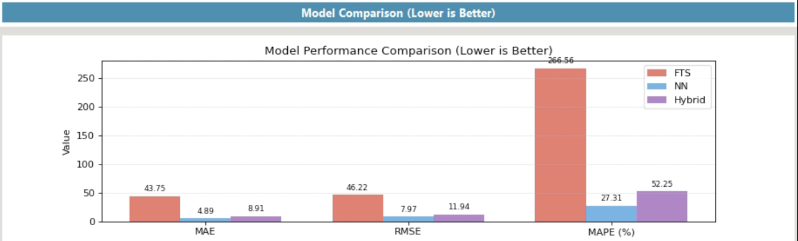
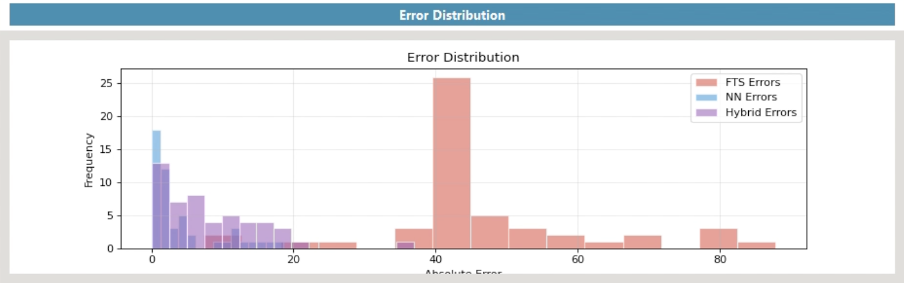
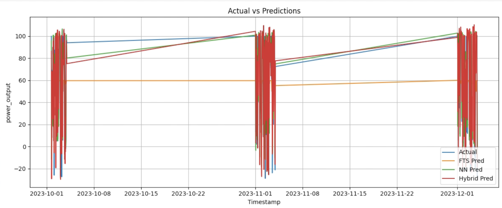
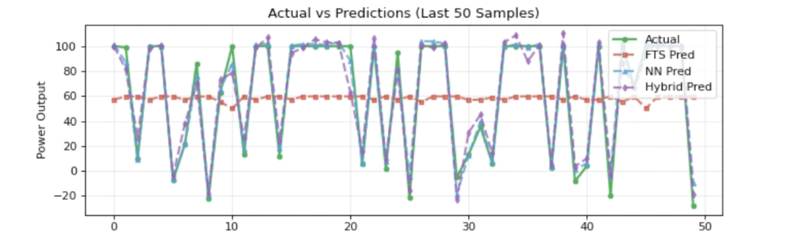

# 🚀  Hybrid Fuzzy-Neural Network for Wind Power Forecasting

---

## Abstract

Accurate wind power forecasting plays a crucial role in ensuring efficient energy management and grid stability. However, wind data is inherently non-linear, uncertain, and time-dependent. This project proposes a hybrid forecasting framework that combines Fuzzy Time Series (FTS) and Neural Networks to improve prediction accuracy. By integrating rule-based reasoning with data-driven learning, the system captures both uncertainty and complex patterns effectively.

---

## Problem Statement

Wind power generation is highly volatile due to environmental fluctuations such as wind speed variations and atmospheric conditions. Traditional statistical models struggle to handle:

* Non-linear relationships
* Temporal dependencies
* Data uncertainty

This project aims to develop a hybrid model that improves forecasting accuracy by combining fuzzy logic with neural networks.

---

## Methodology

The system integrates three approaches:

### 1. Fuzzy Time Series (FTS)

* Converts numerical data into fuzzy intervals
* Handles uncertainty using linguistic rules
* Captures approximate trends

### 2. Neural Network

* Learns non-linear relationships in data
* Models temporal dependencies
* Provides improved predictive performance

### 3. Hybrid Model (FTS + Neural Network)

* Combines fuzzy reasoning with neural learning
* Enhances generalization capability
* Reduces forecasting error

---

## System Workflow

1. Data loading
2. Data preprocessing and normalization
3. Model training (FTS, Neural Network, Hybrid)
4. Prediction generation
5. Performance evaluation
6. Visualization of results

---

## Dataset

The dataset used in this project includes wind energy observations with the following features:

* Wind speed
* Power output
* Time-based attributes

The dataset is moderately sized and structured to simulate real-world wind forecasting scenarios. It is used consistently across all models for training and evaluation.

---

## Evaluation Metrics

Model performance is evaluated using:

* **MAE (Mean Absolute Error)**
* **RMSE (Root Mean Squared Error)**
* **MAPE (Mean Absolute Percentage Error)**

Lower values indicate better prediction accuracy.

---

## Results and Analysis

The results demonstrate clear differences in model performance:

* The **Fuzzy Time Series model** shows higher error due to its limited ability to model complex non-linear relationships
* The **Neural Network model** performs better by capturing hidden patterns in time-series data
* The **Hybrid model** achieves improved performance by combining both approaches

The hybrid model provides a balance between interpretability and accuracy, making it suitable for real-world forecasting applications.

---

## Visual Results

### Model Performance Dashboard

### Model Comparison

### Error Distribution

### Forecast Results

### Detailed Forecast (Last 50 Samples)

---

## Key Contributions

* Development of a hybrid fuzzy-neural forecasting system
* Integration of rule-based and machine learning techniques
* Comparative analysis of multiple models
* Visualization-driven evaluation of forecasting performance
* Implementation of an interactive GUI-based system

---

## Limitations

* The dataset is moderate in size and may not fully represent large-scale real-world scenarios
* The neural network architecture is relatively simple
* External environmental factors are not extensively incorporated

---

## Future Work

* Apply advanced deep learning models such as LSTM for time-series forecasting
* Validate the model on large-scale real-world datasets
* Incorporate additional environmental variables for improved accuracy
* Extend the system for real-time forecasting applications

---

## Demo Video

[Watch Demo Video](https://drive.google.com/file/d/1n084Lqtw0tJVry5EKYe0QBKr7juEYWPX/view?usp=sharing)

---

## Conclusion

This project demonstrates that integrating fuzzy logic with neural networks significantly improves wind power forecasting performance. The hybrid model effectively captures uncertainty and complex temporal patterns, providing a reliable and scalable solution for time-series prediction.

---

## Author

Digumurthy Sruthi Sarika
